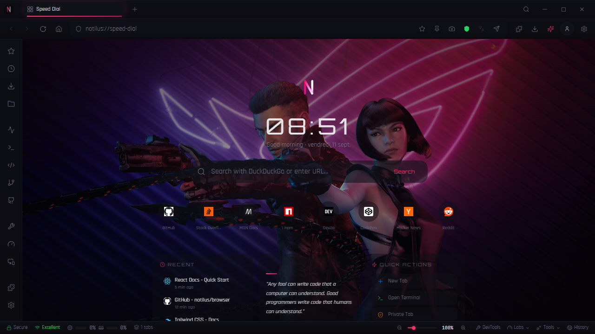

# Nautilus Reborn — Version 2 (Web + Desktop)




Version 2 of Notilus, a modern web-based operating system interface and browser replacement. The project combines a React/Vite web application with an Electron desktop mode and is currently in active development.

## Workspace Organization

The original `NOTILUS` workspace contains three related repositories:

- `Notilus-Browser` → V1 Flutter reference implementation
- `nautilus-reborn` → V2 Web/Desktop main development area
- `notilus-loading` → application presentation page

## Current desktop capabilities

The V2 desktop mode uses Electron and `WebContentsView` for native Chromium rendering of external pages while internal `notilus://*` pages remain in the React UI.

The current README is intentionally based on the capabilities documented by the repository itself, including:

- Typed Electron preload bridge through `window.notilusDesktop`
- Native download capture through Electron's session events
- Downloads panel
- Git panel connected to the local repository
- Configurable sidebar web services
- Panel/tab transfer for web services
- Studio panel with resize presets and capture
- Live CSS/JS tooling
- Recorder export for Playwright/Cypress workflows

## Local development

### Requirements

- Node.js 20+
- npm 10+

### Web mode

```bash
npm install
npm run dev:web
```

### Web production build

```bash
npm run build:web
```

### Tests

```bash
npm run test
```

### Desktop development

```bash
npm run dev:desktop
```

### Desktop build

```bash
npm run build:desktop
```

## V1 → V2 migration model

V1 serves as the business/reference implementation. V2 adapts those concepts to the React + TypeScript + Tailwind + shadcn-oriented stack.

| V1 | V2 |
|---|---|
| `lib/screens` | `src/pages` / browser components |
| `lib/widgets` | `src/components/ui` / browser components |
| `lib/services` | `src/hooks` + `src/lib` + API services |
| `backend/` FastAPI | Remote API or dedicated local service |

## Tech stack

- Vite
- React 18
- TypeScript
- Tailwind CSS 3
- shadcn/ui / Radix UI
- Vitest
- Electron 37
- `WebContentsView`
- Supabase
- `sql.js`, `systeminformation`, `xterm` and related desktop/browser tooling

## Project status

Nautilus Reborn V2 is under active development. The codebase already contains substantial web and desktop infrastructure, but the project should still be treated as a development build rather than a finished operating-system replacement.

## License

No explicit license file was identified in the current repository. Treat the project as **all rights reserved** unless a license is added.

## Screenshot

